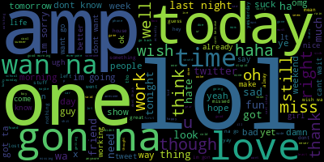
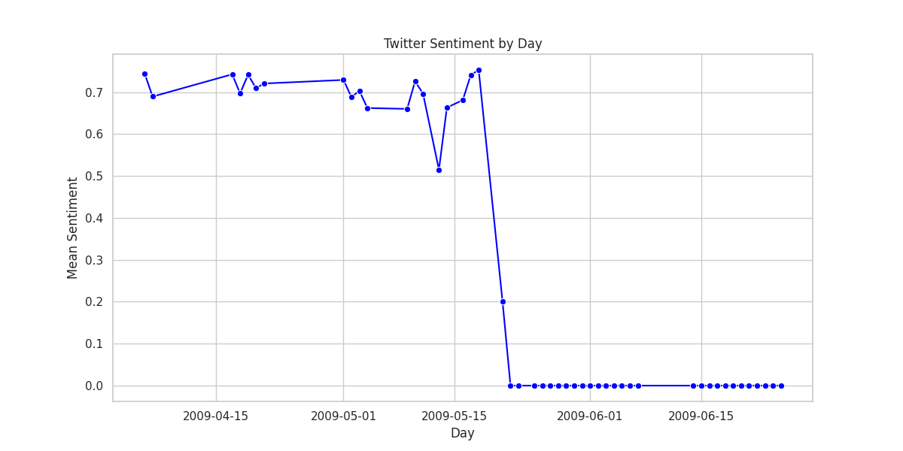

# Twitter Sentiment Analysis

## Intro
This exercise creates a predictive model and performs sentiment analysis on a dataset of 1M tweets in a provided csv. 

## Methods
Source data had tweets with a timestamp, sentiment value, and text of each tweet. Text of these tweets was processed to remove stopwords and special characters, lemmaized, and then vectorized with TF-IDF for machine learning analysis. Sentiment values from source data were already binary, values were set to 0 for negative and 1 for positive sentiment. 

RandomForestClassifier was chosen as an appropriate model for binary classification, and data was split in an 80/20 train/test split. Evaluation metrics of the fitted model were:

```
Accuracy: 0.83348

Classification Report:
               precision    recall  f1-score   support

           0       0.85      0.96      0.90    160075
           1       0.67      0.32      0.44     39925

    accuracy                           0.83    200000
   macro avg       0.76      0.64      0.67    200000
weighted avg       0.82      0.83      0.81    200000

Confusion Matrix:
 [[153790   6285]
 [ 27019  12906]]
```

The RandomForestClassifier model predicted the correct sentiment class 83.33% of the time. However, both precision and recall were significantly higher for negative sentiment than positive, resulting in F1-scores of 90% for negative sentiment and 44% for positive sentiment prediction.

## Sentiment Analysis: How do people on Twitter feel about Twitter?
A subset of tweets containing the word 'twitter' was extracted from the total dataset for sentiment analysis.  This subset was further processed to remove direct references to Twitter (ie 'tweet', 'tweeting', etc) for construction of the WordCloud below. WordClouds were made for the total dataset and for the set of tweets referring to Twitter:

#### WordCloud of all tweets

#### WordCloud of tweets referring to Twitter


Timestamps of tweets were used to contstruct a plot of twitter sentiment by day. Since all tweets were stamped in Pacific Daylight Time timezone with no geographic data, I assumed the timestamps were generated at time/location of data collection rather than extracted from data at time/location of the tweet being sent.  This would have removed potential patterns of sentiment across each day, but would still be appropriate as a 24-hour window rolling average to see patterns across longer timescales.
#### Twitter Sentiment by Day

Sentiment by day seems to stay close to 70% for the first half of the timeframe, then drops to 0 for the remained. I assume this is due to anomalies in timestamp creation.